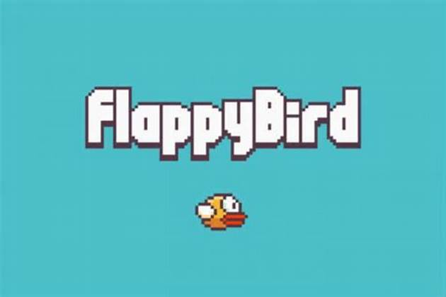
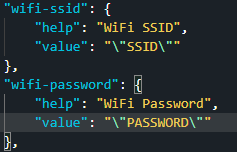
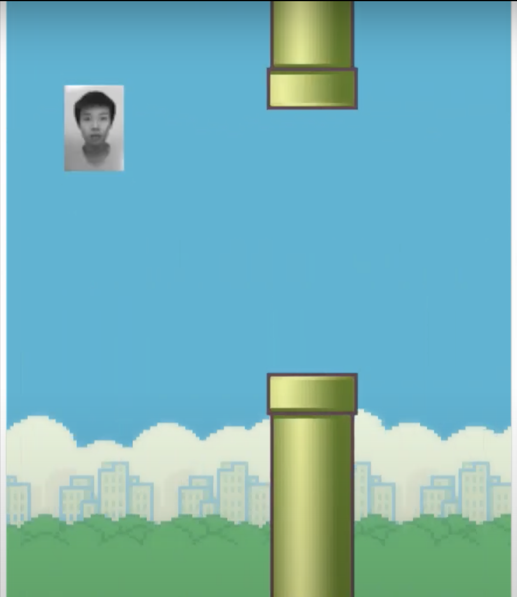

# Embedded System Lab Final Project - Flappy Bird


### Table of content
 - [Introduction](#introduction)
 - [Usage](#Usage)
 - [Requirements](#Requirements)
 - [Demo Video](#Demo)
 - [Screenshot](#Screenshot)
 - [Reference](#reference)

### Introduction

This is the code of Embedded System Lab Final Project  
The project mainly focus on using STM32 boards to control the Flappy Bird Game without gravity.
Authors : B06203017 李俊諺 (Chun-Yen Lee)，B06504016 林家宏 (Chia-Hung Lin)，B06701214 王群博 (Cyun-Bo Wang)  

### Usage
- Install Requirements  
```
pip install -r requirements.txt
python3 rpi/internal/main.py
```
- Run the Program
  - Change SSID and Password in STM32/mbed_app.json  
    
  - Add BSP_B-L475E-IOT01 to library in Mbed Studio
  - Replace main.cpp in the program
  - Compile and run the program

### Requirements
 - Python >= 3.6
 - Pygame
 - Stm32 Node with mbedOS >= 6.11

### Demo

 - First Demo Video     :   
   https://youtu.be/DgRyXdEcQ4Q    
 - Final Demo Video (1) :   
   https://youtu.be/XWOblXyJOK4  
 - Final Demo Video (2) :   
   https://youtu.be/JaakABC_8xs   
 - Final Demo Video (3) :   
   https://youtu.be/YWr3OLMTgC4  


### Screenshot
 - Game Play (With Different Icon)
  

### Reference

Reference of the original game :  
https://www.youtube.com/watch?v=UZg49z76cLw  
Mbed Os documents with board sensors :  
https://os.mbed.com/teams/ST/code/DISCO_L475VG_IOT01-Sensors-BSP/  
BSP_B-L475E-IOT01 Library  
https://os.mbed.com/teams/ST/code/BSP_B-L475E-IOT01/
