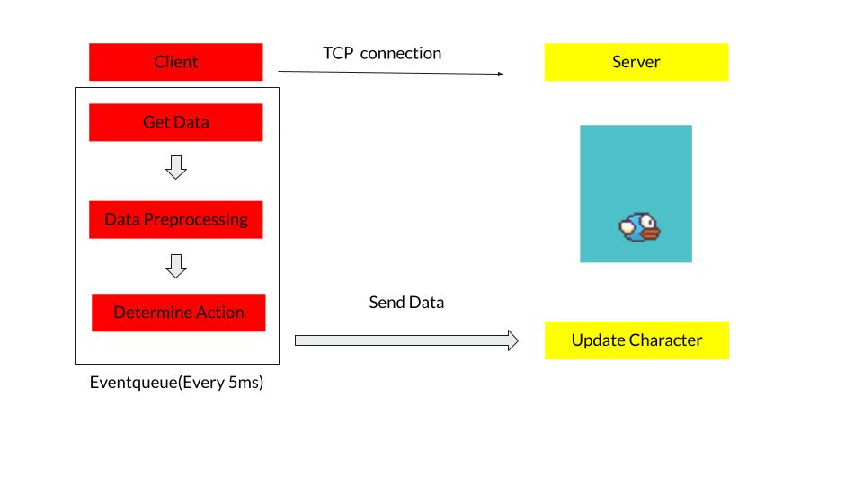
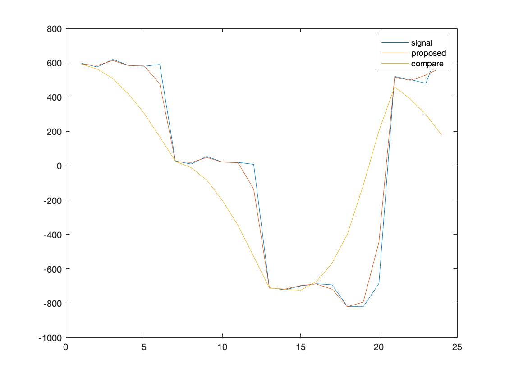
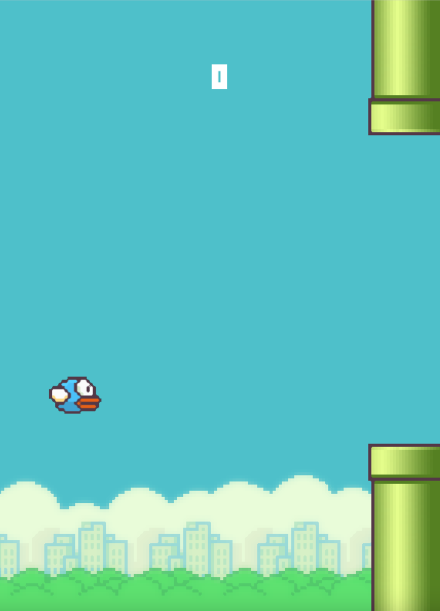

# Embedded System Lab Final Project - KFlappy Bird


### Introduction

This is the code of Embedded System Lab Final Project  
The project mainly focus on using STM32 boards to control the Flappy Bird Game without gravity.  
Authors : B06203017 李俊諺 (Chun-Yen Lee)，B06504016 林家宏 (Chia-Hung Lin)，B06701214 王群博 (Cyun-Bo Wang)  
#### Motivation

Flappy Bird is a game that uses white space to control the character, and the link(https://www.youtube.com/watch?v=I69adfEqwC0) provides information on how to play the game. 
From the video, when the player presses the space button, the character flies and drops immediately. 
However, the initial video game only requires players to press the space button, which seems boring. 
To enhance the user’s experience, we modified the game and used the STM32 board to control the character in the game. 
The modification gives the player more satisfaction by adding more ways to control the character.

#### Design Details
In the original game, there is gravity. 
In our game, we canceled the setting of gravity to make the players more possible actions in the game. 
By tilting forward and backward, we can control the player up and down in the game. 
The detailed flow chart is shown below.



#### Data Processing
The data processing part is processed in the client. 
First, the accelerator collects the data and processes it using the queue. 
We use the queue to store our data to reduce the time of reserving and deleting data. 
After storing the data, we calculate the weighted average of the data. 
The weight of the data strongly affects the user's experience of playing the game. 
When testing our game, we found that the queue with size two and the weight (0.2, 0.8) is the best parameter.

#### Comparison of different ways to process data
The data might encounter noise from the sensor when playing the game, so we use different ways to process the data. 
When the queue size is large, that is, the filter's impulse response is long, the edge of the signal might disappear. 
Also, if the filter is short, the signal isn't smooth. The graph below shows the difference.



We proposed five directions for the players: fly up quickly, fly up slowly, remain height, drop slowly and drop quickly.
We use the y-axis acceleration to decide the player’s direction, and the detailed threshold is listed below

| Threshold            | Value  | Description    |
|----------------------|--------|----------------|
| data[y] < -500       | up = 4 | drop quickly   |
| -500 <= data[y] <= 50| up = 3 | drop slowly    |
| -50 <= data[y] <= 50 | up = 2 | remain height  |
| 50 < data[y] <= 500  | up = 1 | fly up slowly  |
| 500 < data[y]        | up = 0 | fly up quickly |


Moreover, we use the button as the Digital In. 
When the player tilts the board, the button needs to be pressed to make the character move. 
The primary purpose is to avoid accidental movement by the user.


### Usage
- Install Requirements  
```bash
python3 -m pip install -r requirements.txt
python3 game/internal/main.py
```
- Run the Program
  - Change SSID and Password in STM32/mbed_app.json  
    
  - Add BSP_B-L475E-IOT01 to library in Mbed Studio
  - Replace main.cpp in the program
  - Compile and run the program

### Requirements
 - Python >= 3.6
 - Pygame
 - Stm32 Node with mbedOS >= 6.11


### Demo

 - First Demo Video     :   
   https://youtu.be/DgRyXdEcQ4Q    
 - Final Demo Video (1) :   
   https://youtu.be/XWOblXyJOK4  
 - Final Demo Video (2) :   
   https://youtu.be/JaakABC_8xs   
 - Final Demo Video (3) :   
   https://youtu.be/YWr3OLMTgC4  


### Screenshot
Game Play Screenshot 
 


### Reference

Reference of the original game :  
https://www.youtube.com/watch?v=UZg49z76cLw  
Mbed Os documents with board sensors :  
https://os.mbed.com/teams/ST/code/DISCO_L475VG_IOT01-Sensors-BSP/  
BSP_B-L475E-IOT01 Library  
https://os.mbed.com/teams/ST/code/BSP_B-L475E-IOT01/
